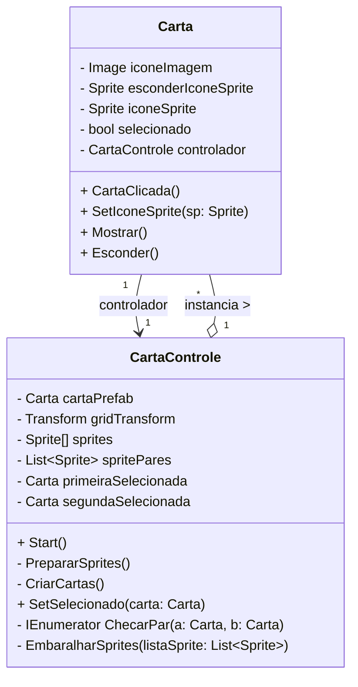

# **BrainParty**

## Documentação do Sistema

### Sumário:

* Dados do Cliente
* Equipe de Desenvolvimento
1. Introdução
2. Objetivo
3. Escopo
4. Backlogs do Produto
5. Cronograma
6. Materiais e Métodos
- Resultados
- Conclusão
- Homologação do MVP junto ao cliente
- Divulgação
- Carta de Apresentação
- Carta de Autorização
- Relato individual do processo
- Cronograma

---

## Dados do Cliente

Título do Projeto: BrainParty, um jogo da memória educativo para crianças memorizarem palavras em Inglês.

- Cliente: ASSOCIAÇÃO O MENOR DA CASA
- CNPJ/CPF: 46.492.059/0001-45
- Contato: Rodrigo de Jesus Roberto
- Email do contato: SERVOFRED@HOTMAIL.COM

---

## Equipe de Desenvolvimento

| Nome Completo | Curso | Disciplina |
| :-----------: | :---: | :--------: |
| Michael de Souza da Silva | S.I | Padrões de Projetos de Software com Java|
| Breno Zachello Oliveira | ADS | Padrões de Projetos de Software com Java|
| Adriano de Sousa Ramos | C.I | Padrões de Projetos de Software com Java|
| Derek Pires Bergesch da Costa | C.I | Padrões de Projetos de Software com Java|
| Felipe Ribeiro Silva | C.I | Padrões de Projetos de Software com Java|

| Professor Orientador |
| :---: |
| Kesede Rodrigues Julio |

---

## 1. Introdução

Nosso projeto visa ajudar a prender a atenção das crianças que frequentam as aulas de reforço do projeto “O Menor Da Casa”, ensinando-as de forma lúdica palavras em inglês, matéria frequentemente negligenciada no sistema público de ensino apesar de sua grande importância.

---

## 2. Objetivo

Esperamos que esse interesse criado pelo jogo torne mais fácil a tarefa de manter as crianças interessadas na matéria, aumentando a taxa de retenção do ensino. E auxiliando de forma dinâmica e intuitiva, o ensinamento de palavras em Inglês.

---

## 3. Escopo

O escopo e a portabilidade inicial do projeto, serão para a plataforma Windows. Planejamos, futuramente, criar Modos de jogo mais avançados alterando a dificuldade do jogo, e fazer um Port do jogo para Mobile (Celulares), são objetivos em uma possível continuação do projeto através dos semestres seguintes.

---

## 4. Backlogs do Produto

Os requisitos levantados foram:

* Jogo será intuitivo e de fácil navegação, para crianças utilizarem.
* Educacional em sua natureza e palavras simples, para servir como aprendizado.
* UI do menu inicial limpa e objetiva, poucos botões, para fácil inicialização do jogo.
* Imagens das cartas, figuras educativas, exemplos: (Arvores, Frutas, Veiculos, Objetos do dia a dia, etc.)
* Mecânica simples de interação, através de toques com os elementos do jogo.
* Lógica das cartas, para verificação da correta.

---

## 5. Cronograma

## 6. Materiais e Métodos

### A) Modelagem do sistema:

### B) Tecnologias utilizadas:

#### Engine (Motor Gráfico): **Unity**

#### Bibiliotecas utilizadas:

**using System.Collections.Generic;**
> Permite usar coleções genéricas como List<T>, Dictionary<TKey, TValue>, etc.
- Útil para armazenar listas e mapas de objetos com tipos definidos.

**using System.Collections;**
> Permite usar coleções não genéricas como ArrayList e corrotinas com IEnumerator.
- Necessário para usar StartCoroutine() e loops com yield.

**using UnityEngine;**
> Importa a base do motor Unity, incluindo classes como GameObject, Transform, MonoBehaviour, etc.
- Essencial em praticamente todos os scripts Unity.

**using UnityEngine.UIElements;**
> Permite usar o sistema de UI moderno da Unity, chamado UI Toolkit.
- Usado para criar interfaces com VisualElement, Button, Label, etc.

**using PrimeTween;**

> Biblioteca de animações simples e eficientes para Unity.

- Usada para animar propriedades como rotação, escala, posição e cor com facilidade.

- Permite criar sequências de animações encadeadas com comandos como Tween.Rotation, Tween.Delay e Sequence.Create().

- Mais leve e intuitiva que sistemas como DOTween ou iTween, ideal para jogos 2D e interfaces rápidas.

## 7. Resultados

**Protótipo:**

**Códigos das principais funcionalidades:**

## 8. Conclusão

**a. Impacto do sistema:**
 - O sistema ainda não foi implementado porém é esperada um aumento no interesse 
das crianças em aprender inglês de forma ativa, além do aprendizado passivo gerado pelo 
jogo.

**b. Melhorias Futuras:**
- Maneiras diferentes de concluir objetivos 
- Mais cartas 
- Possiveis novos minigames
- Versão mobile e/ou we

 
