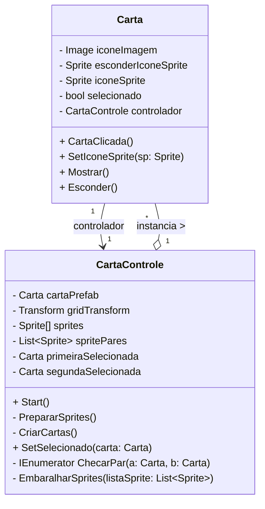
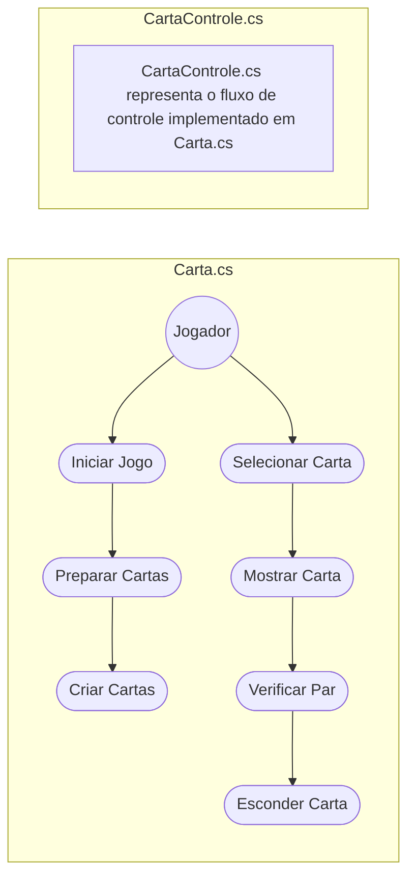

# **BrainParty**

## Documentação do Sistema

### Sumário:

1. ​​Dados do Cliente
2. ​Equipe de Desenvolvimento
3. Introdução
4. Objetivo
5. Escopo
6. Backlogs do Produto
7. Cronograma
8. Materiais e Métodos
9. Resultados
10. Conclusão
11. Homologação do MVP junto ao cliente
12. Divulgação
13. Carta de Apresentação
14. Carta de Autorização
15. Relato individual do processo
16. Cronograma

---

## Dados do Cliente

Título do Projeto: BrainParty, um jogo da memória educativo para crianças memorizarem palavras em Inglês.

- Cliente: ASSOCIAÇÃO O MENOR DA CASA
- CNPJ/CPF: 46.492.059/0001-45
- Contato: Rodrigo de Jesus Roberto
- Email do contato: SERVOFRED@HOTMAIL.COM

---

## Equipe de Desenvolvimento

| Nome Completo | Curso | Disciplina |
| :-----------: | :---: | :--------: |
| Michael de Souza da Silva | S.I | Padrões de Projetos de Software com Java|
| Breno Zachello Oliveira | ADS | Padrões de Projetos de Software com Java|
| Adriano de Sousa Ramos | C.I | Padrões de Projetos de Software com Java|
| Derek Pires Bergesch da Costa | C.I | Padrões de Projetos de Software com Java|
| Felipe Ribeiro Silva | C.I | Padrões de Projetos de Software com Java|

| Professor Orientador |
| :---: |
| Kesede Rodrigues Julio |

---

## Introdução

Nosso projeto visa ajudar a prender a atenção das crianças que frequentam as aulas de reforço do projeto “O Menor Da Casa”, ensinando-as de forma lúdica palavras em inglês, matéria frequentemente negligenciada no sistema público de ensino apesar de sua grande importância.

---

## Objetivo

Esperamos que esse interesse criado pelo jogo torne mais fácil a tarefa de manter as crianças interessadas na matéria, aumentando a taxa de retenção do ensino. E auxiliando de forma dinâmica e intuitiva, o ensinamento de palavras em Inglês.

---

## Escopo

O escopo e a portabilidade inicial do projeto, serão para a plataforma Windows. Planejamos, futuramente, criar Modos de jogo mais avançados alterando a dificuldade do jogo, e fazer um Port do jogo para Mobile (Celulares), são objetivos em uma possível continuação do projeto através dos semestres seguintes.

---

## Backlogs do Produto

Os requisitos levantados foram:

* Jogo será intuitivo e de fácil navegação, para crianças utilizarem.
* Educacional em sua natureza e palavras simples, para servir como aprendizado.
* UI do menu inicial limpa e objetiva, poucos botões, para fácil inicialização do jogo.
* Imagens das cartas, figuras educativas, exemplos: (Arvores, Frutas, Veiculos, Objetos do dia a dia, etc.)
* Mecânica simples de interação, através de toques com os elementos do jogo.
* Lógica das cartas, para verificação da correta.

---

## Cronograma

 
